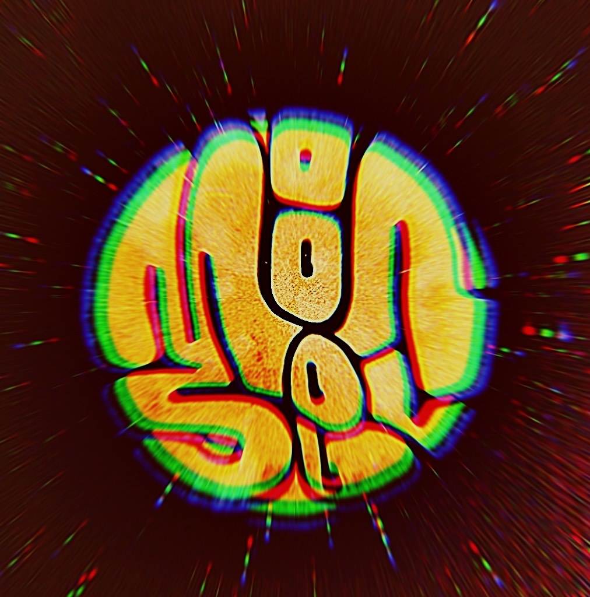

# Moon Soul Band Web Page 🌙🎵
Welcome to the official repository for the Moon Soul band's web page. Discover more about the band, view upcoming events, explore our store, and meet the members.



## Features
- **Home Page:** Discover upcoming events.
- **Store:** Shop exclusive Moon Soul merchandise from vinyls to apparel.
- **Photos Page:** Dive into the visual journey of the band.
- **About Page:** Meet the personalities and talent of Moon Soul.

## Technologies Used
- **Frontend:** React
- **Backend:** Python & Flask
- **Payment:** Stripe API

## Setup and Installation
### Ensure you have pipenv installed. If not, install it using:
```
pip install pipenv
```
### Clone the repository:
**Using HTTPS:** 
```
git clone https://github.com/jsullivan94/moon-soul.git
```
**Using SSH:**
``` 
git clone git@github.com:jsullivan94/moon-soul.git
```
### Navigate to the project directory:
```
cd moon-soul
```
### Install the required dependencies:
**Frontend:**
```
cd client
```
```
npm install
```
**Backend:**
```
cd server
```
```
pipenv install
```
### Activate the pipenv shell on backend:
```
pipenv shell
```
### Run the project:
**Frontend:**
```
npm start
```
**Backend:**
```
python app.py
```
For a complete demo of the web app, refer to this demo video link: https://www.loom.com/share/41a00647c6a2474a9f463de8cb0d81a8

